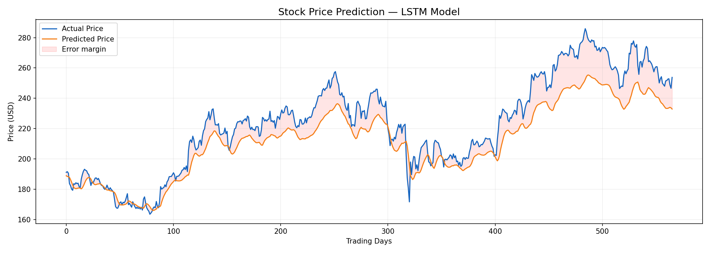

# 📈 Stock Price Prediction with LSTM

  
*Add your model prediction image above*

---

[](https://www.python.org/) 
[](https://www.tensorflow.org/) 
[](LICENSE)

---

## 🌟 Project Overview
This is my **first deep learning project**!  
The goal: predict stock prices using an **LSTM (Long Short-Term Memory) model**.  

Even though the model is **beginner-level** and has some jerks, it was a fantastic learning experience in **time series forecasting** and **deep learning**.

---

## 📊 Dataset
- **Source:** [Yahoo Finance](https://finance.yahoo.com/) via `yfinance`  
- **Period:** 2014 – 2026  
- **Features:** Open, High, Low, Close, Volume  
- **Target:** Next day closing price  

---

## 🛠 Project Steps

### 1️⃣ Data Collection
- Fetch historical stock prices using `yfinance`.  

### 2️⃣ Data Cleaning & Preprocessing
- Handle missing values.  
- Scale data using **MinMaxScaler**.  
- Convert data to sequences suitable for LSTM.

### 3️⃣ Model Building
- **LSTM architecture** using TensorFlow/Keras:  
  - Input Layer → LSTM Layers → Dense Output Layer  
  - Loss: **Mean Squared Error (MSE)**  

### 4️⃣ Prediction & Visualization
- Predict stock prices.  
- Compare **actual vs predicted prices** with charts.

---

## 💡 Key Learnings
- Handling **time series data** for deep learning models.  
- Preprocessing is **critical** for sequence models.  
- Hands-on experience with **LSTM** and **prediction pipelines**.  
- Learned that **first models are rarely perfect**, but they teach a lot!

---

## ⚡ Challenges
- Model has some **errors and jerks** due to beginner-level design.  
- Limited hyperparameter tuning.  
- Future improvements: optimize model, explore **GRU or Transformer models**.

---


🔮 Future Work
Improve model accuracy via hyperparameter tuning.
Explore advanced architectures: GRU, BiLSTM, Transformers.
Build a web app dashboard to showcase predictions live.


## 🧰 Requirements
```bash
pip install yfinance pandas numpy matplotlib tensorflow scikit-learn
