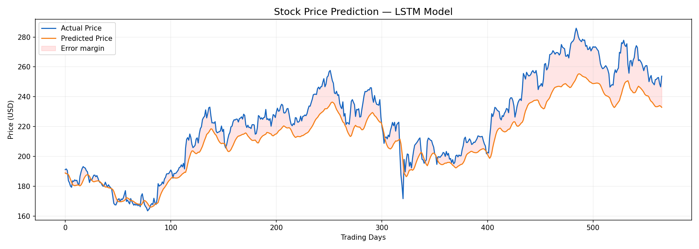

# Stock Price Prediction

## Introduction

The **Stock Price Prediction** project is a machine learning-based application designed to forecast future stock prices by analyzing historical market data. The main purpose of this project is to discover patterns in stock price movements and generate predictions that can support financial analysis and decision-making. This project combines data preprocessing, visualization, and predictive modeling to demonstrate the practical use of data science in the finance domain.

---

## Project Overview

This project predicts stock prices using historical stock market data that includes daily trading information. The system processes past market records and applies machine learning algorithms to estimate future price movements.

### Main Objectives

- Analyze historical stock data  
- Identify market trends  
- Build a predictive model  
- Compare actual and predicted prices  
- Evaluate model performance  

---

## Dataset Description

The dataset contains historical stock market records where each row represents one trading day.

### Dataset Features

| Column Name | Description |
|-------------|-------------|
| `Date` | Trading date |
| `Open` | Opening stock price |
| `High` | Highest stock price |
| `Low` | Lowest stock price |
| `Close` | Closing stock price |
| `Volume` | Number of shares traded |

### Dataset Characteristics

- Time-series dataset  
- Numerical financial records  
- Daily stock information  
- Suitable for regression modeling  

---

## Methodology

The project follows a structured machine learning workflow.

### 1. Data Collection

The stock market dataset is loaded into a Pandas DataFrame for analysis.

### 2. Data Preprocessing

The preprocessing steps include:

- Removing missing values  
- Formatting date values  
- Sorting records by time  
- Feature scaling  
- Data transformation  

### 3. Exploratory Data Analysis

The data is visualized to understand:

- Price trends  
- Volatility  
- Correlation between features  

### 4. Model Training

The machine learning model is trained on historical stock data using:

- Training dataset  
- Testing dataset  
- Regression algorithms  

### 5. Prediction

The trained model predicts future stock prices based on previous market behavior.

### 6. Performance Evaluation

Model performance is evaluated using:

- Mean Absolute Error (`MAE`)  
- Mean Squared Error (`MSE`)  
- Root Mean Squared Error (`RMSE`)  

---

## Results

The model successfully captured stock movement patterns and generated future price estimates.

### Actual vs Predicted Stock Price



### Key Results

- Predicted stock price trends  
- Compared actual and predicted values  
- Measured model accuracy  
- Demonstrated financial forecasting capability  

---

## Conclusion

This project shows how machine learning can be applied to stock market forecasting. Although stock prices are affected by many unpredictable factors, historical data can still provide valuable insights for future estimation. The project serves as a strong foundation for more advanced financial prediction systems.

---

## How to Run

### Clone the Repository

```bash
git clone https://github.com/Ayeshakhan77/Stock_price_prediction.git
```

### Navigate to the Project Folder

```bash
cd Stock_price_prediction
```

### Install Dependencies

```bash
pip install -r requirements.txt
```

### Run the Project

```bash
python main.py
```

---

## Technologies Used

- `Python`
- `Pandas`
- `NumPy`
- `Matplotlib`
- `Scikit-learn`
- `TensorFlow / Keras`

---

## Future Improvements

Possible future improvements include:

- Live stock API integration  
- Advanced deep learning models  
- Interactive dashboard  
- Multi-stock comparison support  

---
